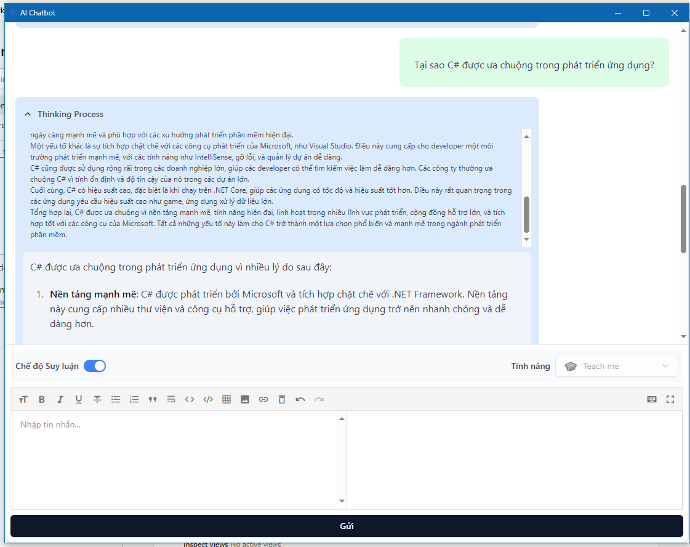
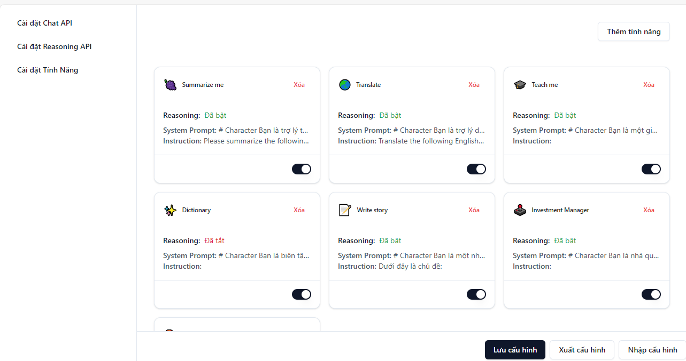
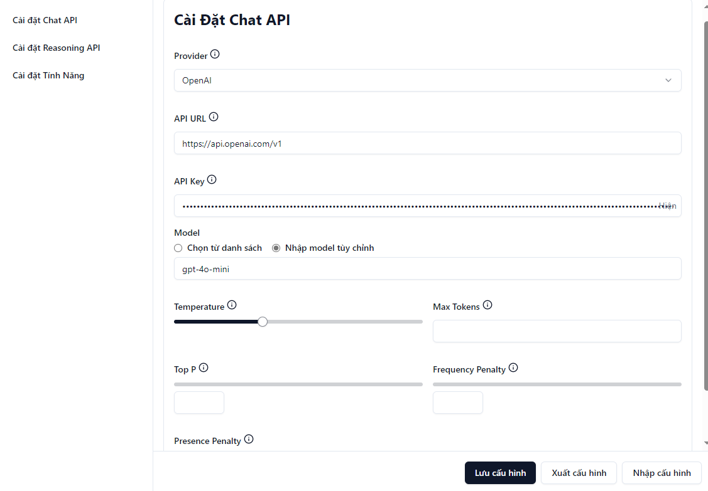
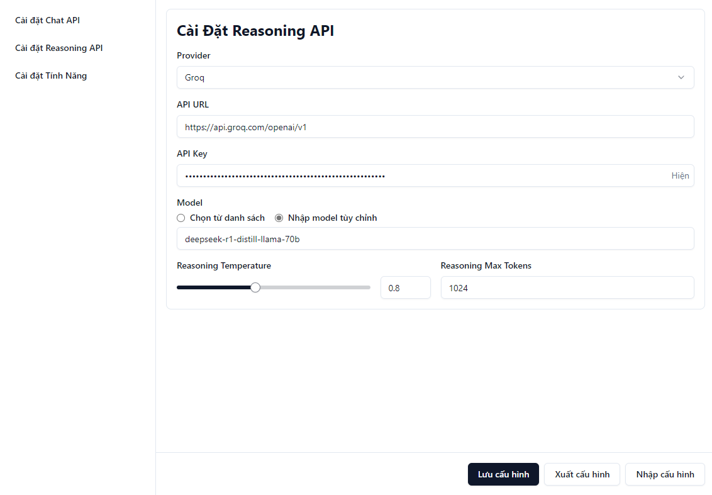

# AI Chatbot Chrome Extension




Một tiện ích mở rộng Chrome cung cấp thông tin chi tiết về văn bản được chọn bằng AI. Tiện ích này tích hợp với các API AI hàng đầu để cung cấp câu trả lời thông minh và chính xác.

## Tính năng chính

- **Hỗ trợ đa nền tảng AI**: Tích hợp linh hoạt với nhiều nhà cung cấp AI hàng đầu như OpenAI, Anthropic, DeepSeek...
- **Tư duy logic nâng cao**: Tính năng "reasoning" giúp AI phân tích và đưa ra lập luận chặt chẽ
- **Hỗ trợ đa ngôn ngữ**: Tối ưu hóa cho tiếng Việt, hỗ trợ đa dạng ngôn ngữ khác
- **Giao diện thân thiện**: Thiết kế đơn giản, trực quan với Tailwind CSS
- **Cấu hình linh hoạt**: Cho phép tùy chỉnh sâu các thông số API, mô hình AI và cài đặt nâng cao
- **Tính năng tùy biến**: Tạo và quản lý các tính năng tùy chỉnh theo nhu cầu người dùng
- **Hỗ trợ Markdown**: Hiển thị và chỉnh sửa nội dung với Markdown

## Cài đặt

1. Clone repository:
   ```bash
   git clone https://github.com/minhhungit/react-chat-app-chrome-extension.git
   ```
2. Cài đặt dependencies:
   ```bash
   npm install
   ```
3. Build extension:
   ```bash
   npm run build
   ```
4. Mở Chrome và truy cập `chrome://extensions/`
5. Bật chế độ "Developer mode"
6. Click "Load unpacked" và chọn thư mục `dist` vừa build

## Cấu hình

1. Mở trang cài đặt của extension
2. Nhập API key và cấu hình các thông số:
   - API URL
   - Mô hình AI
   - Nhiệt độ (Temperature)
   - Số token tối đa (Max tokens)
3. Lưu cấu hình

## Sử dụng

1. Chọn văn bản trên bất kỳ trang web nào
2. Click chuột phải và chọn "AI Chatbot" từ menu ngữ cảnh
3. Xem kết quả phân tích và tương tác với chatbot

## Công nghệ sử dụng

- **Frontend**: React, Tailwind CSS, Radix UI
- **State management**: MobX
- **AI Integration**: OpenAI API, Anthropic AI
- **Build tool**: Webpack
- **Markdown**: React Markdown, Markdown-it

## Hỗ trợ

Nếu bạn gặp bất kỳ vấn đề nào, vui lòng tạo issue trên GitHub hoặc liên hệ qua email it.minhhung@gmail.com

## Giấy phép

Dự án này được cấp phép theo MIT License - xem file [LICENSE](LICENSE) để biết thêm chi tiết

## Đóng góp

Chúng tôi luôn hoan nghênh các đóng góp! Vui lòng đọc [CONTRIBUTING.md](CONTRIBUTING.md) để biết cách tham gia phát triển dự án.

## Phiên bản

Hiện tại: v1.0.0

## Roadmap

- [x] Tích hợp OpenAI API
- [x] Hỗ trợ tiếng Việt
- [ ] Thêm hỗ trợ cho các API AI khác
- [ ] Tích hợp chức năng dịch thuật
- [ ] Thêm chế độ dark mode 


